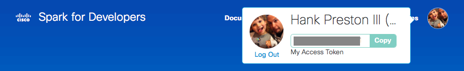

# CICD Learning Lab

Here are links to each part of the lab.  They do build on each other so be sure to go in order.

1. [Environment Prep](environment_prep.md)
2. [Stage 1 - Continuous Integration](cicd_stage_1.md)
3. [Stage 2 - Continuous Delivery](cicd_stage_2.md)
4. [Install the Application](app_install.md)
5. [Stage 3 - Continuous Deployment](cicd_stage_3.md)
6. [Stage 4 - Monitoring and Notify Phase](notify_phase.md)
7. [Bonus - CICD In Action!](bonus.md)
8. [Clean-Up](cleanup.md)

## Introduction

This lab is intended to be an introduction to setting up a very basic CI/CD (Continuous Integration/Continuous Delivery) Pipeline.  There are many different technologies and methods that can be used for CI/CD, in this lab we will use:

* Cisco's Mantl Container Stack - <a href="http://mantl.io" target="_blank">Mantl.io</a> which includes:
  * Docker Container Engine - [Docker](http://www.docker.com)
  * Mesos Scheduler - [Mesos/Marathon](http://mesos.apache.org)
* Development Language - Python and Flask
* Source Control - [github.com](https://github.com)
* Container Registry - [hub.docker.com](http://hub.docker.com)
* CICD Server - [drone.io](http://drone.io)
* Notifications - [CiscoSpark.com](http://CiscoSpark.com)

# Prerequisites

To run through this lab, you will need to have accounts (all free) created with the following services, as well as a set of tools properly setup on your laptop or workstation.

## Accounts

* [github.com](https://github.com)
* [hub.docker.com](http://hub.docker.com)
  * **Note: if you are using 2FA for your docker account, let the admin know, as that will change how you do authentication later in the lab exerices.
* [CiscoSpark.com](http://CiscoSpark.com)
  * You will also use your Spark login to retrieve the Spark API token. Go to [developer.ciscospark.com](http://developer.ciscospark.com), where you will find your token by logging into the developer portal, clicking on your image in the upper right corner, and clicking **Copy**
    

## Laptop or Workstation

To successfully complete this lab, you must have a supported working environment (i.e. laptop/workstation).  There are two options for meeting this requirement:

1. Natively use your own workstation by installing and configuring the below list of software and utilities.
2. Run the lab within the provided Docker container to avoid the need to install additional software on your workstation.
   * **_For this option, you will need to have the ability to run a Docker container on your workstation.  Options for this include native Docker installation, boot2docker, or docker-machine options._**

_Though Windows Operation Systems are becoming more common with developers, and many development tools and utilities are being made available natively for Windows users, the exercises in this lab are **NOT** supported on Windows Natively.  If you are working from a Windows machine, please use the provided Docker Container option._

### Option 1: Leverage your Native Workstation

If you will be completing the lab using your native workstation, you will need to ensure the following components are installed and functioning correctly.

* git
  * command line tools required
  * GUI clients optional
  * Installation Instructions: [https://git-scm.com/book/en/v2/Getting-Started-Installing-Git](https://git-scm.com/book/en/v2/Getting-Started-Installing-Git)
* docker
  * for platforms with native docker available (ie Linux/Mac) having the docker daemon installed and running can be used
  * docker-machine is also fully acceptable for this lab
  * Installation Instructions: [https://docs.docker.com/engine/installation/](https://docs.docker.com/engine/installation/)
    * Optionally, you can install the full Docker toolbox for [Mac](https://docs.docker.com/v1.10/mac/), [Linux](https://docs.docker.com/v1.10/linux/), or [Windows](https://docs.docker.com/v1.10/windows/)
* Python 2.7
  * Installation Instructions: [https://www.python.org/downloads/](https://www.python.org/downloads/)
  **_Note: If you already have Python 3.x installed, you may still need to install 2.7.
* drone command line tools
  * drone is the CICD tool used for this lab, and the command line tools are used to properly secure the secret information (i.e. userids, passwords) used for all the services utilized
  * _the tools require docker to be installed and working_
  * Installation Instructions: [http://readme.drone.io/devs/cli](http://readme.drone.io/devs/cli)
  * Basic Installation Steps
    * Linux
      * `curl http://downloads.drone.io/drone-cli/drone_linux_amd64.tar.gz | tar zx`
      * `sudo install -t /usr/local/bin drone`
    * Mac
      * `curl http://downloads.drone.io/drone-cli/drone_darwin_amd64.tar.gz | tar zx`
      * `sudo cp drone /usr/local/bin`

### Option 2: Run the Lab within a Container

If your workstation is Windows based, or you prefer to NOT use your native workstation, you can run the lab exercises from within a Docker container.  _To use this method, you will need to be able to run a Docker container on a host machine somewhere._

From your Docker host, run the following command to pull down and enter an interactive shell on the provided development container.

```
# It may take some time to complete this command while the full container is downloaded
docker run -it --name cicdlab hpreston/devbox:cicdlab

[root@cf95a414877e coding]#

```

This will put you at a prompt similar to the above.  The container is a Linux based working environment with the following utilities and software installed and ready to use.

* vim
* git
* docker
  * the container has the docker tools installed, but the `docker run` command above will **NOT** enable you to run additional containers from inside
  * running containers is not a required step in the lab, but if you would like to do so, you can use the following command instead

    ```
    docker run -it --name cicdlab -v /var/run/docker.sock:/var/run/docker.sock hpreston/devbox:cicdlab
    ```

  * this command will link the docker daemon on the host machine into the container
* drone cli tools

If you exit out of the container before completing the lab and want to continue from where you left off, do not execute a `docker run` command again.  This will create a new clean container that lacks any of your work.  Instead follow the below to start the original container .

```
# Verify that you have  a container in a stopped state
docker ps -a

CONTAINER ID        IMAGE                         COMMAND             CREATED             STATUS                        PORTS               NAMES
cf95a414877e        hpreston/devbox:cicdlab       "/bin/bash"         2 minutes ago       Exited (0) 10 seconds ago                         cicdlab

# Restart your stopped container
docker start -i cicdlab

[root@cf95a414877e coding]#
```

## Lab Environment Details

For this lab you will be leveraging a Lab Mantl Instance and Drone Build Server.  Your lab admin will provide the following information.  Make a note of these details as you will need them periodically during the following lab exercises.

* Drone Build Server Address (referred to as DRONE_SERVER)
* Mantl Control Server Address (referred to as "Mantl Control Server")
* Mantl Username 
* Mantl Password
* Mantl Application Domain (referred to as "Lab Application domain")
* Spark RoomId for Notifications (a hash key provided for Spark Room notifications and referred to as SPARK_ROOM)

## Next Step!

Now that you've got all the pre-reqs setup, move onto the next step.

1. [Environment Prep](environment_prep.md)
