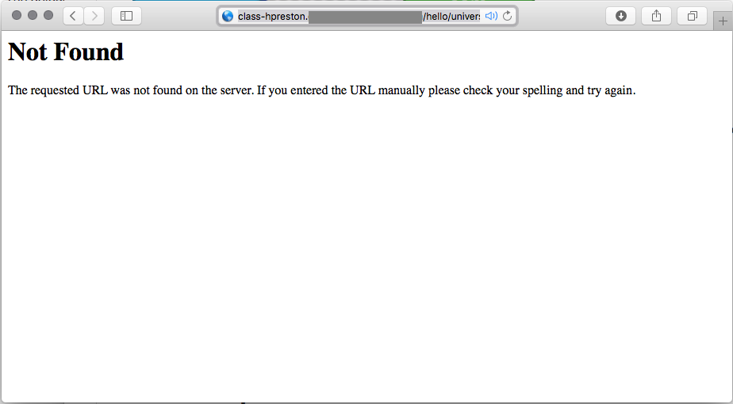
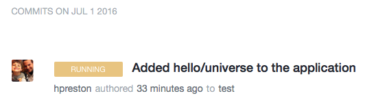
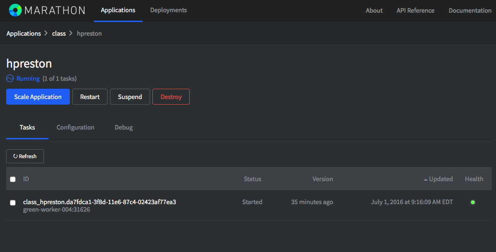
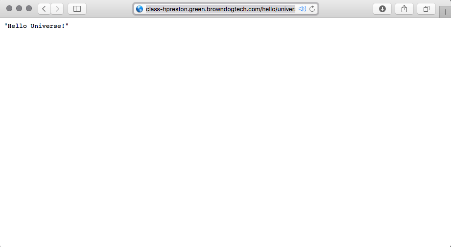
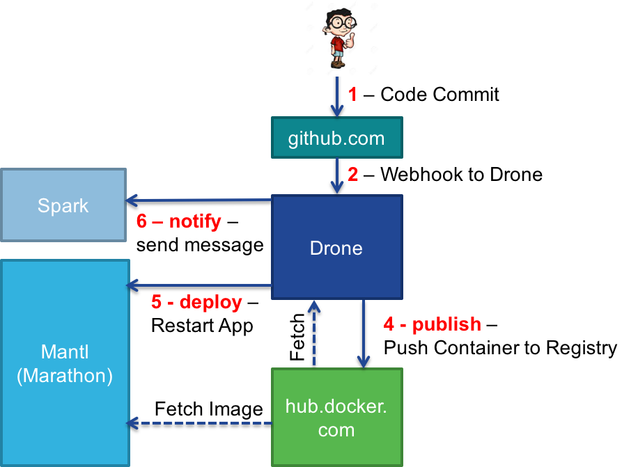

**_Before beginning this step, be sure to be at a command line prompt from your prepared working environment.  This will either be your local machine, or within the provided container._**

#### Reminder: Working in the docker container

```
# Start a clean instance of the container
docker run -it --name cicdlab hpreston/devbox:cicdlab

[root@cf95a414877e coding]# exit

# If you need to restart an exited container
# Verify that you have  a container in a stopped state
docker ps -a

CONTAINER ID        IMAGE                         COMMAND             CREATED             STATUS                        PORTS               NAMES
cf95a414877e        hpreston/devbox:cicdlab       "/bin/bash"         2 minutes ago       Exited (0) 10 seconds ago                         cicdlab

# Restart your stopped container
docker start -i cicdlab

[root@cf95a414877e coding]#
```

## Let's put that pipeline to use!

Now that we have our full CICD pipeline up and running, let's make some application changes and watch them deploy.

## Verify that the default app status

The default demo app has a single route `hello/world`.  We will be adding an additional route to the application, but let's verify that it doesn't exist already.

1. Try to navigate to `hello/universe` at your application.  This would be available at a URL such as `http://class-USERNAME.mantl.domain.com/hello/universe`, but replace **USERNAME** with your Docker Username, and **mantl.domain.com** with the Lab Application Domain provided by your instructor.
2. You should get back a page not found error.

    

## Add /hello/universe to the app

**_In this step you will be entering several commands in a terminal window.  These need to be run from your local repo directory.  If you followed the directions when cloning the repo locally, this command will place you in the correct directory_**

```
cd ~/coding/cicd_demoapp
```

1. In your editor or IDE, open `demoapp.py` and add the new class and resource for HelloUniverse.  You can simply copy and paste the below into your editor.

    ```
    from flask import Flask, request
    from flask_restful import Resource, Api, reqparse


    app = Flask(__name__)
    app = Flask(__name__)
    api = Api(app)

    class HelloWorld(Resource):
        def get(self):
            text = "Hello World!"
            return text

    api.add_resource(HelloWorld, '/hello/world')

    class HelloUniverse(Resource):
        def get(self):
            text = "Hello Universe!"
            return text

    api.add_resource(HelloUniverse, '/hello/universe')

    if __name__ == '__main__':
        # Runn Flask
        app.run(debug=True, host='0.0.0.0', port=int("5000"))
        # pass

    ```
2. Since we are **NOT** changing the actual build process stored in `.drone.yml`, we don't need to recreate the secrets file.  Once the build process is complete, as long as new tests or steps aren't added these files can be left alone.  Developers can focus on their code and changes, not the build process.
3. Commit and push our updated application to begin the CICD process.
    ```
    # add the file to the git repo
    git add demoapp.py

    # commit the change
    git commit -m "Added hello/universe to the application"

    # push changes to GitHub
    git push
    ```

4. Check the drone server to verify the build has begun.  You can also monitor the Spark room for the completed message.

    

5. Once drone completes the build, check Marathon and watch as the application restarts.

    

6. Wait for Marathon to show the application as healthy.

    

7. Refresh the web page with the `hello/universe` page **Not Found**.  You should now have your new message available.

    

8. Feel free to experiment with more changes to the application.  Each commit will result in the application restarting with the updated code.


## Current Build Pipeline Status

Okay, so let's review the steps in the full pipeline.



1. You committed and pushed code to GitHub.com
2. GitHub sent a WebHook to the Drone server notifying it of the committed code.
3. Drone checks the _.drone.yml_ file and executes the commands in the _build_ phase. During this phase, Drone will: 
  * Fetch a container from hub.docker.com.  This container is identified in the `image: python:2` line of the drone config file.  Drone will run the commands and tests described in this phase from the fetched container
  * Send a notification message to the subscribed Spark room stating that the build has begun. 
4. Drone checks the _.drone.yml_ file and executes the commands in the _publish_ phase. During this phase, Drone will: 
  * Build a Docker Container using the Dockerfile definition included in the Git repo
  * Push the container up to hub.docker.com using the credentials contained in the secrets file
5. Drone checks the _.drone.yml_ file and executes the commands in the _deploy_ phase. In this phase, the following actions will take place: 
  * Drone sends a WebHook command to Marathon to cause an application restart
  * Marathon pulls the new container from hub.docker.com containing the code changes
6. Drone checks the _.drone.yml_ file and executes the commands in the _notify_ phase. During notification, Drone will check the staus of the build and then send notifications to the Spark room.
  * If the build was successful, send a Success notification
  * If the build failed, send a Failure notificiation and blame someone.

## Next Step!

Time to move onto the final step, clean-up!

8. [Clean-Up](cleanup.md)


