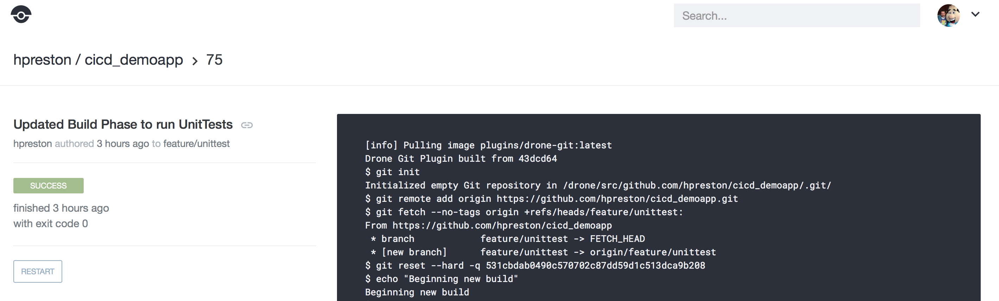
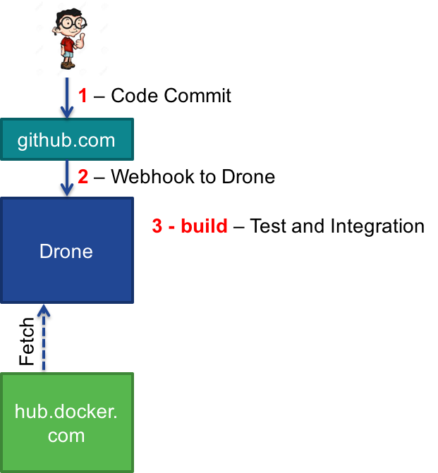

**_Before beginning this step, be sure to be at a command line prompt from your prepared working environment.  This will either be your local machine, or within the provided container._**

#### Reminder: Working in the docker container

```
# Start a clean instance of the container
docker run -it --name cicdlab hpreston/devbox:cicdlab

[root@cf95a414877e coding]# exit

# If you need to restart an exited container
# Verify that you have  a container in a stopped state
docker ps -a

CONTAINER ID        IMAGE                         COMMAND             CREATED             STATUS                        PORTS               NAMES
cf95a414877e        hpreston/devbox:cicdlab       "/bin/bash"         2 minutes ago       Exited (0) 10 seconds ago                         cicdlab

# Restart your stopped container
docker start -i cicdlab

[root@cf95a414877e coding]#
```

# CICD Stage 1: Continuous Integration

The first step of the CICD process is to react to new code commits and test the changes against the larger application needs.  In this lab, we will configure drone to send an alert to a Spark room each time a commit has been made.

## Update the .drone.yml configuration

In the root of the code repository is a file named _.drone.yml_ that provides the instructions to Drone on what actions to take upon each run.  We will be updating this file at each stage of the lab to move from Continuous Integration -> Delivery -> Deployment.

**_In this step you will be entering several commands in a terminal window.  These need to be run from your local repo directory.  If you followed the directions when cloning the repo locally, this command will place you in the correct directory_**

```
cd ~/coding/cicd_demoapp
```


1. Open the _.drone.yml_ file in your editor.  The file should begin looking like the code block below.  The _build_ directive at the top represents where the integration phase of the process will take place.  In the _commands:_ list are the different steps needed to validate a successful code change.  Currently nothing is being done, _env_ is simply a placeholder command to display all current environment variables in the build container.
    ```
    build:
      image: python:2
      commands:
        - env
    ```

2. Add a new line to the file that will send an informational notice to the Spark room (identified by the roomId stored in the secrets file as SPARK_ROOM) that a new build has started.  This command uses curl to send an API call to Cisco Spark.
    1. **NOTE: You can simply copy and paste the contents from below directly into your file.  The notation of _$$VARIABLE_ references details stored within the encryped .drone.sec file.  Do NOT replace them with clear text credentials or you will be flogged.**

    ```
    build:
      image: python:2
      commands:
        - env
        - curl https://api.ciscospark.com/v1/messages -X POST -H "Authorization:Bearer $$SPARK_TOKEN" --data "roomId=$$SPARK_ROOM" --data "text=Drone kicking off build $CI_BUILD_NUMBER"
    ```

3. As part of the security of drone, every change to the _.drone.yml_ file requires the secrets file to be recreated.  Since we've updated this file, we need to re-secure our secrets file.
    ```
    # Replace USERNAME with your GitHub username
    drone secure --repo USERNAME/cicd_demoapp --in drone_secrets.yml
    ```

    1. If the command above gives the error `Error: you must provide the Drone server address.`, you likely closed the terminal window after the Environment Prep step.  Run these commands to reset the environment variables.

        ```
        export DRONE_SERVER=http://DRONE_SERVER
        export DRONE_TOKEN=<your token>
        ```

4. Now commit and push the changes to the drone configuraiton and secrets file to GitHub.
** Remember if you are using an IDE, be careful not to commit & push the changes to the file drone_secrets.yml
    ```
    # add the file to the git repo
    git add .drone.sec
    git add .drone.yml

    # commit the change
    git commit -m "Updated Build Phase to notify with Spark"

    # push changes to GitHub
    git push
    ```

5. Now check the Drone web interface. A new build should have kicked off.  Also, watch for the Spark message to come through in the client. If you don't see it, check to see if notifications are turned on in Spark.

    

6. Click on the build and scroll through the log displayed.  You can use this log to monitor the process in each stage as we add additional steps to the build process. The Drone log window also has an arrow at the bottom right that you can click and it will automatically tail the end of the log file as it progresses. 

    

7. If the build reports a **Failure**, or the Spark message never comes, check the log to see what might have gone wrong.  Common reasons include forgetting to re-create the secrets file, forgetting to commit the secrets file after recreating, or mis-entered credentials in the plain text secrets file.

## Current Build Pipeline Status

Okay, so drone said it did something and we got a Spark message... but you may be wondering what actually happened.  This image and walkthrough shows the steps that are occuring along the way.



1. You committed and pushed code to GitHub.com
2. GitHub sent a WebHook to the Drone server notifying it of the committed code.
3. Drone checks the _.drone.yml_ file and executes the commands in the _build_ phase. During this phase, Drone will: 
  * Fetch a container from hub.docker.com.  This container is identified in the `image: python:2` line of the drone config file.  Drone will run the commands and tests described in this phase from the fetched container
  * Send a notification message to the subscribed Spark room stating that the build has begun. 


## Next Step!

Time to move onto the next step.

[Stage 2 - Continuous Delivery](cicd_stage_2.md)

