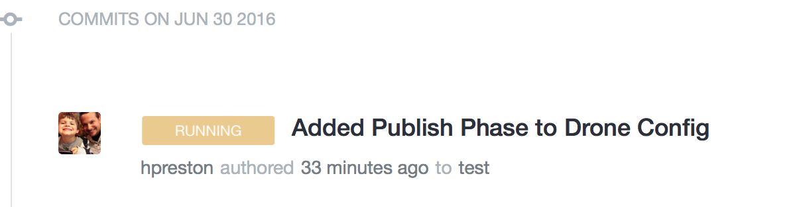
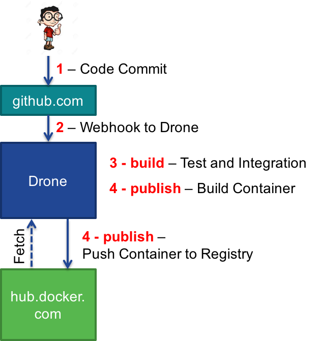

**_Before beginning this step, be sure to be at a command line prompt from your prepared working environment.  This will either be your local machine, or within the provided container._**

#### Reminder: Working in the docker container

```
# Start a clean instance of the container
docker run -it --name cicdlab hpreston/devbox:cicdlab

[root@cf95a414877e coding]# exit

# If you need to restart an exited container
# Verify that you have  a container in a stopped state
docker ps -a

CONTAINER ID        IMAGE                         COMMAND             CREATED             STATUS                        PORTS               NAMES
cf95a414877e        hpreston/devbox:cicdlab       "/bin/bash"         2 minutes ago       Exited (0) 10 seconds ago                         cicdlab

# Restart your stopped container
docker start -i cicdlab

[root@cf95a414877e coding]#
```

## CICD Stage 2: Continuous Delivery

In this step, we will take our successfully tested application, build a Docker Container, and publish it to a docker registry where it can be used as an artifact for our application.
## Update the .drone.yml configuration

In the root of the code repository is a file _.drone.yml_ that provides the instructions to drone on what actions to take upon each run.  We will be updating this file at each stage of the lab to move from Continuous Integration -> Delivery -> Deployment.

**_In this step you will be entering several commands in a terminal window.  These need to be run from your local repo directory.  If you followed the directions when cloning the repo locally, this command will place you in the correct directory_**

```
cd ~/coding/cicd_demoapp
```


1. Open the _.drone.yml_ file in your editor.  We will be adding the next phase, _publish_ to the existing configuration.  Update your drone file to look like this.
    1. **NOTE: You can simply copy and paste the contents from below directly into your file.  The notation of _$$VARIABLE_ references details stored encrypted within the .drone.sec file.  Do NOT replace them with clear text credentials.**

    ```
    build:
      image: python:2
      commands:
        - env
        - curl https://api.ciscospark.com/v1/messages -X POST -H "Authorization:Bearer $$SPARK_TOKEN" --data "roomId=$$SPARK_ROOM" --data "text=Drone kicking off build $CI_BUILD_NUMBER"

    publish:
      docker:
        repo: $$DOCKER_USERNAME/cicd_demoapp
        tag: latest
        username: $$DOCKER_USERNAME
        password: $$DOCKER_PASSWORD
        email: $$DOCKER_EMAIL
    ```

2. As part of the security of drone, every change to the _.drone.yml_ file requires the secrets file to be recreated.  Since we've updated this file, we need to re-secure our secrets file.
    ```
    # Replace USERNAME with your GitHub username
    drone secure --repo USERNAME/cicd_demoapp --in drone_secrets.yml
    ```

    1. If the command above gives the error `Error: you must provide the Drone server address.`, you likely closed the terminal window after the Environment Prep step.  Run these commands to reset the environment variables.

        ```
        export DRONE_SERVER=http://DRONE_SERVER
        export DRONE_TOKEN=<your token>
        ```

3. Now commit and push the changes to the drone configuraiton and secrets file to GitHub.
    ```
    # add the file to the git repo
    git add .drone.sec
    git add .drone.yml

    # commit the change
    git commit -m "Added Publish Phase to Drone Config"

    # push changes to GitHub
    git push
    ```

4. Now check the Drone web interface. A new build should have kicked off.  Also, watch for the Spark message to come through in the client. 

    

5. If the build reports a **Failure**, or the Spark message never comes, check the log to see what might have gone wrong.  Common reasons include forgetting to re-create the secrets file, forgetting to commit the secrets file after recreating, or mis-entered credentials in the plain text secrets file.
6. Once the build completes, log into [hub.docker.com](hub.docker.com), and open your repo.  Click the _Tags_ tab.  You should see a new tag of _latest_ displayed.  This is the container that was build and pushed up by drone.

    

## Current Build Pipeline Status

Okay, so drone said it did something and we got a Spark message... but you may be wondering what actually happened.  This image and walkthrough shows the steps that are occuring along the way.



1. You committed and pushed code to GitHub.com
2. GitHub sent a WebHook to the Drone server notifying it of the committed code.
3. Drone checks the _.drone.yml_ file and executes the commands in the _build_ phase. During this phase, Drone will: 
  * Fetch a container from hub.docker.com.  This container is identified in the `image: python:2` line of the drone config file.  Drone will run the commands and tests described in this phase from the fetched container
  * Send a notification message to the subscribed Spark room stating that the build has begun. 
4. Drone checks the _.drone.yml_ file and executes the commands in the _publish_ phase. During this phase, Drone will: 
  * Build a Docker Container using the Dockerfile definition included in the Git repo
  * Push the container up to hub.docker.com using the credentials contained in the secrets file


## Next Step!

Time to move onto the next step.

[Install the Application](app_install.md)


