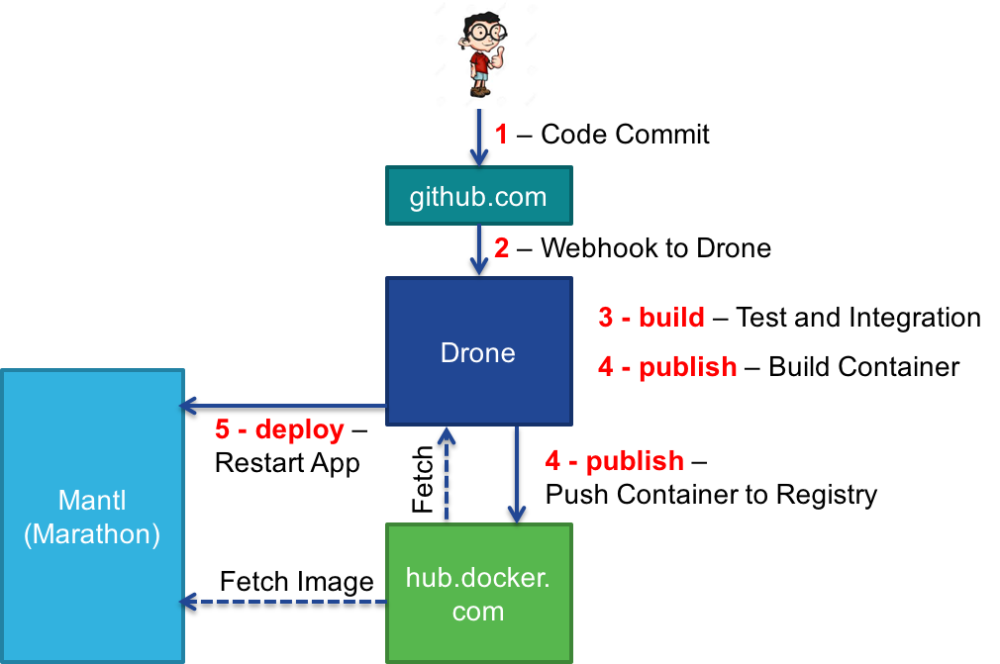

## CICD Stage 3: Continuous Deployment

In this step, we will automatically deploy our changes by issuing a restart command that will pull down the new docker container.

## Update the .drone.yml configuration

In the root of the code repository is a file _.drone.yml_ that provides the instructions to drone on what actions to take upon each run.  We will be updating this file at each stage of the lab to move from Continuous Integration -> Delivery -> Deployment.

1. Open the _.drone.yml_ file in your editor.  We will be adding the next phase, _deploy_ to the existing configuration.  Update your drone file to look like this.
    ```
    build:
      image: python:2
      commands:
        - env
        - curl https://api.ciscospark.com/v1/messages -X POST -H "Authorization:Bearer $$SPARK_TOKEN" --data "roomId=$$SPARK_ROOM" --data "text=Drone kicking off build $CI_BUILD_NUMBER"

    publish:
      docker:
        repo: $$DOCKER_USERNAME/cicd_demoapp
        tag: latest
        username: $$DOCKER_USERNAME
        password: $$DOCKER_PASSWORD
        email: $$DOCKER_EMAIL


    deploy:
      webhook:
        image: plugins/drone-webhook
        skip_verify: true
        method: POST
        auth:
          username: $$MANTL_USERNAME
          password: $$MANTL_PASSWORD
        urls:
          - https://$$MANTL_CONTROL/marathon/v2/apps/class/$$DOCKER_USERNAME/restart?force=true
    ```

2. As part of the security of drone, every chance to the _.drone.yml_ file requires the secrets file to be recreated.  Sense we've updated this file, we need to resecure our secrets.
    ```
    # Replace USERNAME with your GitHub username
    drone secure --repo USERNAME/cicd_demoapp --in drone_secrets.yml
    ```

3. Now commit and push the changes to the drone configuraiton and secrets file to GitHub.
    ```
    # add the file to the git repo
    git add .drone.sec
    git add .drone.yml

    # commit the change
    git commit -m "Added Deploy Phase to Drone Config"

    # push changes to GitHub
    git push
    ```

4. Now check the Drone web interface, and a new build should have kicked off.  And watch for the Spark message to come through in the client.

    

5. If the build reports a **Failure**, or the Spark message never comes, check the log to see what might have gone wrong.  Common reasons include forgetting to re-create the secrets file, forgetting to commit the secrets file after recreating, or mis-entered credentials in the plain text secrets file.
6. While the build is running, open Marathon from the Lab Mantl installation, and watch your application.  When Drone gets to the deploy phase, you should see a new task get created as the application restarts.

    


## Current Build Pipeline Status

Okay, so drone said it did something and we got a Spark message... what actually happened.  This image and walkthrough shows the steps that are occuring along the way.



1. You committed and pushed code to GitHub.com
2. GitHub sent a WebHook to the drone server notifying it of the commit.
3. Drone checks the _.drone.yml_ file and executes the commands in teh _build_ phase.
  * As part of this phase, drone fetches a container, identified in the `image: python:2` line of the config, from hub.docker.com.  It will run the commands and tests described in this phase from this container.
  * Send a message to Spark
4. Drone checks the _.drone.yml_ file and executes the commands in the _publish_ phase.
  * Build a Docker Container using the Dockerfile within the repo
  * Push the container up to hub.docker.com using the credentials in the secrets file
5. Drone checks the _.drone.yml_ file and executes the commands in the _deploy_ phase.
  * Drone sends a WebHook command to Marathon to cause an application restart
  * Marathon pulls the new container from hub.docker.com containing the code changes