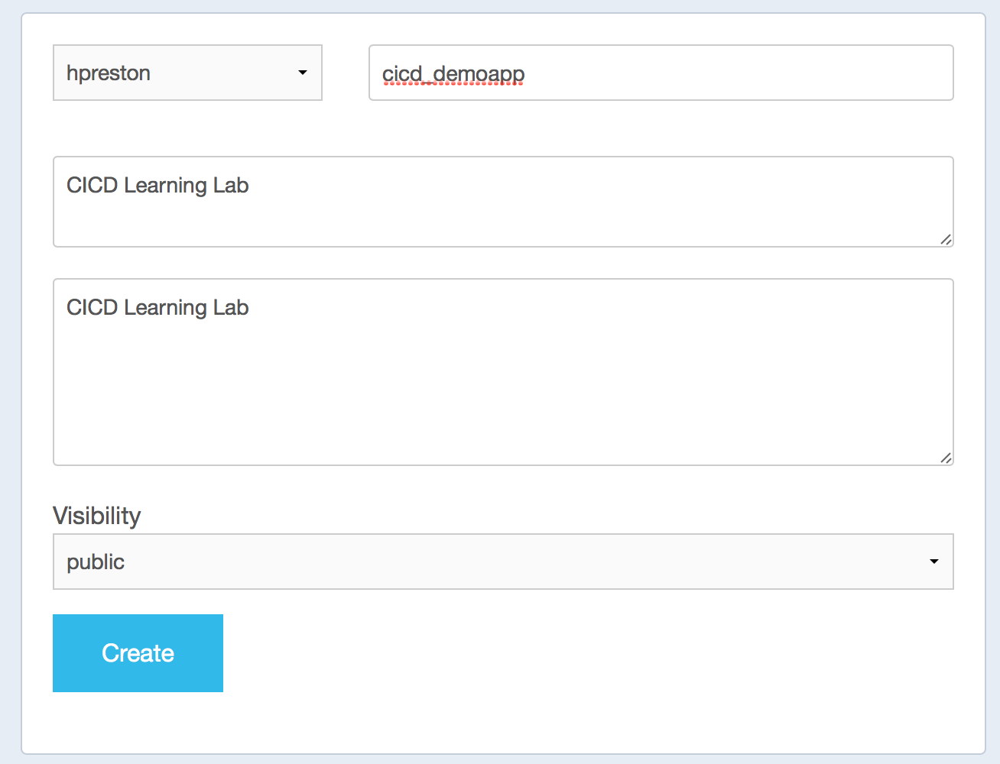

**_Before beginning this step, be sure to be at a command line prompt from your prepared working environment.  This will either be your local machine, or within the provided container._**

#### Reminder: Working in the docker container

```
# Start a clean instance of the container
docker run -it --name cicdlab hpreston/devbox:cicdlab

[root@cf95a414877e coding]# exit

# If you need to restart an exited container
# Verify that you have  a container in a stopped state
docker ps -a

CONTAINER ID        IMAGE                         COMMAND             CREATED             STATUS                        PORTS               NAMES
cf95a414877e        hpreston/devbox:cicdlab       "/bin/bash"         2 minutes ago       Exited (0) 10 seconds ago                         cicdlab

# Restart your stopped container
docker start -i cicdlab

[root@cf95a414877e coding]#
```

# Environment Prep

With all the pre-reqs completed, you are ready to start the lab.  We'll start by setting up our new application code repo, container repository, and continuous integration server configuration.

## Forking the cicd_demoapp GitHub Repo

1. Log into GitHub and visit the demo app repo [hpreston/cicd_demoapp](https://github.com/hpreston/cicd_demoapp)
2. Click **Fork** to create a copy of the repo in your account

    

3. Make a local clone of **YOUR** repo on your laptop.  Do NOT clone the `hpreston/cicd_demoapp` repo. In this case, we will create a directory called "coding". If you choose to deviate from that directory name, just remember what directory you created for your local repo, as this will be used multiple times through the lab. 
    ```
    # if you don't have a local directory where you keep projects, create one
    mkdir ~/coding

    # enter this new directory (or where ever you keep your code)
    cd ~/coding

    # clone your fork of the demo app
    # replace USERNAME with your GitHub user name
    git clone https://github.com/USERNAME/cicd_demoapp

    ```

## Create empty Docker Repository for the Application Container

1. Log into [hub.docker.com](http://hub.docker.com) with your account
2. Click the blue **Create Repository** button in the upper right corner

    

3. Name the repo _cicd_demoapp_ and provide a short description.

    


## Activate the Repo in Drone

1. **Make sure the lab administrator has enabled your GitHub account on the lab server.**
2. Navigate to the drone server address provided by the lab administrator, and click **Login**.

    

3. Drone uses GitHub for authentication, so you will either be prompted to log into your account, and then authorize drone, or simply authorize drone if you're already logged into GitHub.
4. Once you've logged in, click the **Available Repositories** tab in the upper right corner.

    

5. Find the _cicd_demoapp_ repo in the list, and click to activate it.  Drone will then setup a WebHook in GitHub to be notified of relevant events, such as as code pushes, automatically.

    

6. On the **Active Repositories** tab, you should now see a new entry for the cicd_demoapp.  If you click on it, there should be no builds reported yet.

## Application and Build Secrets File

In order for Drone to be able to do the hard work of testing your application, building a container and publishing it to your registry, notifying your team of status, and deploying the updated code to production, it requires credentials for several systems to act on your behalf.  These details are often referred to as _secrets_ in application development.   As a general rule, you want to protect these details through encryption to maintain their security.  Commiting your passwords to a code repo is never a good idea, but it is especially bad when using a public repo like github.com.

Drone provides a method to create an encrypted file with needed secrets that can be safely included in a code repo.  This is why we installed the drone command line utilities as part of the pre-reqs.

**_In this step you will be entering several commands in a terminal window.  These need to be run from your local repo directory.  If you followed the directions when cloning the repo locally, this command will place you in the correct directory_**

```
cd ~/coding/cicd_demoapp
```

1. The drone utilities on your laptop need to know the address and access information for the drone server you are using.  We use session environment variables for this. You will replace the variable's value with the information the lab admin gives you. The follow code can be copied and pasted directly into a terminal window if you'd like to do that, but you can also just type in the line that doesn't start with the hash mark.
    ```
    # Configure the drone server address,
    # Use the address provided by the lab administrator
    export DRONE_SERVER=http://DRONE_SERVER
    ```

2.  Find your personal Drone token by viewing your profile in the drone console.  Click the down arrow next to your picture in the upper right corner and navigate to _Profile_.  Click the button to _Show Token_ and copy the displayed value.

    

3.  Copy/Paste or execute this command to store the value in your terminal session.
    ```
    # Configure your token
    export DRONE_TOKEN=<your token>
    ```

3. Test the command line tools by listing the repositories configured.  You should see your cicd_demoapp listed like below. If you don't see something similar, please let the lab admin know.
    ```
    drone repo ls

    <yourusername>/cicd_demoapp
    ```

4. Next we will create the clear text version of our secrets file.  This file is only used to build the encrypted version and should **NEVER** be added to or commited to your repo.  A sample template for the secrets file was included in the demo app.  We will copy this file and edit it to put in the values that we will use for the lab exercises.
    ```
    cp drone_secrets_sample.yml drone_secrets.yml
    ```

5. Edit the copied file in whatever IDE or editor you prefer.  You'll need to provide the details on each line of the file.  This is a YML format, so be sure to maintain proper spacing, including a single space after the colon in each line.
    ```
    environment:
      SPARK_TOKEN: <FROM YOUR DEVELOPER.CISCOSPARK.COM ACCOUNT>
      SPARK_ROOM: <EITHER ONE OF YOUR OWN ROOMS, OR A ROOMID PROVIDED BY THE LAB ADMIN>
      DOCKER_USERNAME: <YOUR HUB.DOCKER.COM USERNAME>
      DOCKER_PASSWORD: <YOUR HUB.DOCKER.COM PASSWORD>
      DOCKER_EMAIL: <YOUR HUB.DOCKER.COM EMAIL ADDRESS>
      MANTL_USERNAME: <MANTL USER PROVIDED BY LAB ADMIN>
      MANTL_PASSWORD: <MANTL PASSWORD PROVIDED BY LAB ADMIN>
      MANTL_CONTROL: <MANTL SERVER ADDRESS PROVIDED BY LAB ADMIN>
    ```

6. Save your secrets file, but do NOT add or commit it to your repo.
7. Run this command to create the encrypted **.drone.sec** file.
    ```
    # Replace USERNAME with your GitHub username
    drone secure --repo USERNAME/cicd_demoapp --in drone_secrets.yml
    ```

8. Add this file to git, commit and push it to GitHub.  When you `git push` you may be prompted for your GitHub credentials, provide them. The code below will commit and push ONLY the encrypted file, not the clear text file. 
** Note: if you are using a graphical IDE and choose to use that for your commit/push actions, it's very easy to _accidentally_ save and commit all changed files in a directory, therefore _accidentally_ pushing your clear text secrets YML file. Be conscious of what you commit and push.  
    ```
    # add the file to the git repo
    git add .drone.sec

    # commit the change
    git commit -m "Added .drone.sec file"

    # push changes to GitHub
    git push
    ```

9. Return to the drone server web interface and look at your repo status.  You should see a build has kicked off.

    

**In each of the following steps, you will be repeating the steps to secure your secrets.  If you close your terminal window, you will need to re-export the DRONE_SERVER and DRONE_TOKEN values**

## Next Step!

Now that you have prepped your application code repository, docker registry and cicd server, move onto the next step.

[Stage 1 - Continuous Integration](cicd_stage_1.md)

