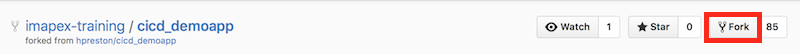

### Steps
1. Log into GitHub and visit the demo app repo [imapex-training/cicd_demoapp](https://github.com/imapex-training/cicd_demoapp)
2. Click **Fork** to create a copy of the repo in your account

    

